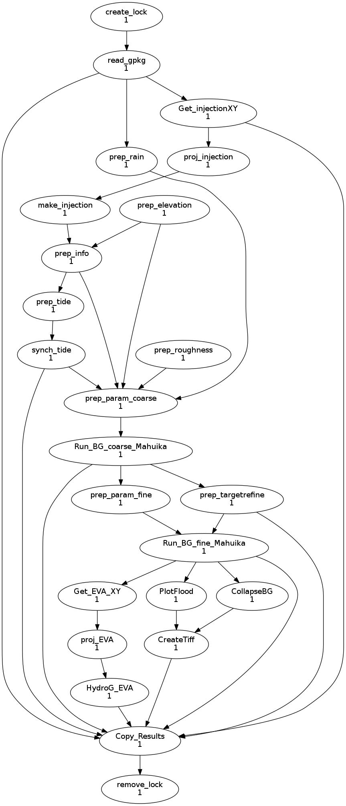

# BG_cylc

Cylc repo for BGFlood process

# Getting started


## Setup cylc on Maui
```
export CYLC_VERSION=8.0.0
export PROJECT=niwa03440
```

## Setup Julia
BG_cylc uses `Julia` in a lot of sub-processes.
First load the Julia module

`
module load Julia/1.7.1-GCC-9.2.0-VTune
`

### Set the depot path for Julia

[Click here for a good tutorial on how to use/setup julia on cluster.](https://researchcomputing.princeton.edu/support/knowledge-base/julia)

The first time you use Julia (for a given project) you need to setup a path where Julia will find it's already installed/pre-compiled packages. this should be project dependant but user independant.

By default Julia will install packages in your Home directory , and that is bad practice. Instad locate that folder that is persistent where all can find it.

e.g.:

`
export JULIA_DEPOT_PATH=/nesi/project/niwa03440/julia/depot
`
### Set a project path/id 
This is where Julia will store which version of which package to use whernever the "project" is activated.

```
$ julia
julia>  # start package manager by pressing ] key
(v1.7) pkg> activate "/nesi/project/niwa03150/bosserellec/SamoaTonga_Forecast/Demo"
(Demo) pkg> add DelimitedFiles

# If you need to leave that environment
(project1) pkg> activate  # leave the environment
(@v1.7) pkg>
```
### Using Julia 

```
cd Wokfolder

module load Julia/1.7.1-GCC-9.2.0-VTune

export JULIA_DEPOT_PATH=/nesi/project/niwa03150/myproject/Julia_Depo

julia --project=/nesi/project/niwa03150/myproject myjuliascript.jl


```

### Running the workflow

```
cylc install .
cylc validate .
cylc play bg_cylc
```

## Required data
 * BF_flood domain


# Workflow visualisation



